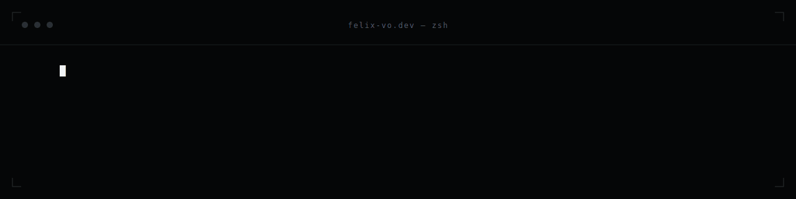

<!--
  BANNER: replace the src below with your own header image.
  Recommended: ~1280x320px, hosted in this repo (e.g. /assets/banner.png).
  Keep it minimal and on-brand — your name + role, your portfolio's visual language.
-->

  

<h1 align="center">Hi, I'm Felix 👋</h1>

  <b>Senior Frontend Engineer</b> · React / Next.js · Design Systems · Ho Chi Minh City 🇻🇳

  5+ years building scalable, high-performance web apps in healthcare &amp; SaaS —
  design-system ownership, real-time platforms, and frontend architecture that holds up at scale.

  <a href="https://www.felix-vo.dev/">🌐 Portfolio</a> ·
  <a href="https://www.linkedin.com/in/alex-vo-hoang/">💼 LinkedIn</a>

---

### 🔭 What I'm into

- **Frontend architecture & design systems** — I own a versioned component library used across multiple products, and care about DX, Core Web Vitals, and rendering strategy (SSR / SSG / ISR).
- **Real-time platforms** — video consultation, live chat, and appointment tracking with Tencent RTC and Socket.io.
- **Self-hosted AI automation** — building an agent-driven homelab: OpenClaw for orchestration, n8n for workflows, Tailscale for the mesh, all on Docker. → [homelab-ai-automation](https://github.com/BoPoppy/homelab-ai-automation)

### 🛠️ Tech I work with

  

### 🎥 Beyond the editor

Badminton, videography (DJI Osmo Action), and color-grading footage in Premiere — usually with a self-hosted automation experiment running in the background.

---

<i>Frontend engineer who likes to tinker with infra and agents.</i>

